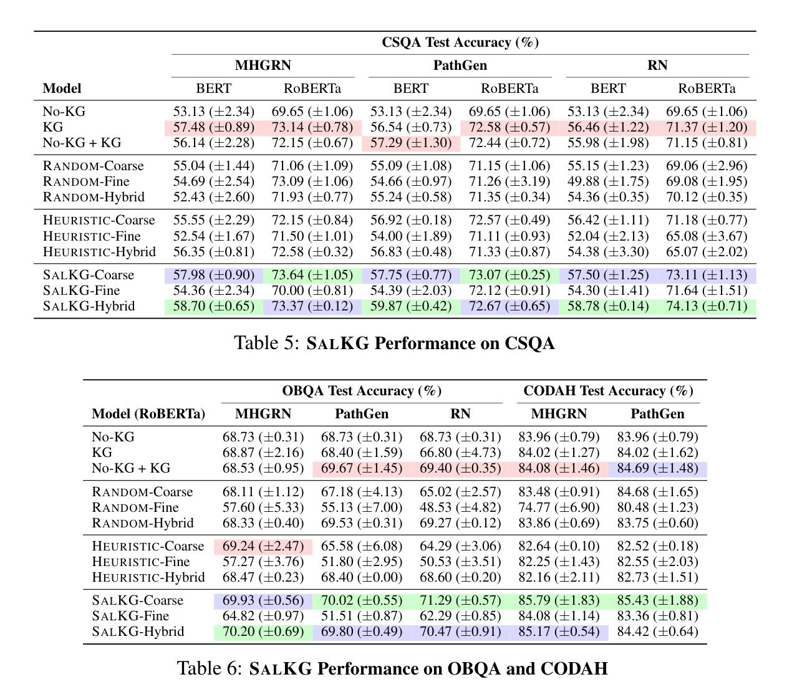

# SalKG

[](https://arxiv.org/abs/2104.08793) 

This is the official PyTorch implementation of our NeurIPS 2021 [paper](https://arxiv.org/abs/2104.08793)

```
SalKG: Learning From Knowledge Graph Explanations for Commonsense Reasoning
Aaron Chan, Jiashu Xu*, Boyuan Long*, Soumya Sanyal, Tanish Gupta, Xiang Ren
NeurIPS 2021
*=equal contritbution
```

**Please note that this is still under construction**

**TODO**

- [ ] fine occl
- [ ] hybrid models
- [x] release dataset files
- [ ] clean up configs

## Requirements

- python >= 3.6
- pytorch >= 1.7.0

After you have pytorch (preferably with cuda support), please install other requirements
by `pip install -r requirements.txt`

## Data

First download [csqa data](https://drive.google.com/file/d/1T5hHXHHj8QUrzzsbqzIZ3fnIgF7Vi4Dr/view?usp=sharing) and unzip. The default folder is `data`. 
Then download [embeddings](https://drive.google.com/file/d/1DUWgXYL7h-LoV6pM8IzyE-inIi1VqBEr/view?usp=sharing), unzip and put `tzw.ent.np` to `data/mhgrn_data/cpnet/` and `glove.transe.sgd.rel.npy` to `data/mhgrn_data/transe`.

The final dataset folder should look like this

```
data/ # root dir
  csqa/
    path_embedding.pickle

  mhgrn_data/
    csqa/
      graph/      # extracted subgraphs
      paths/      # unpruned/pruned paths
      statement/  # csqa statement
    cpnet/
    transe/
```

## Usage

We use neptune to track our experiment. Please set the api token and project id by

```
export NEPTUNE_API_TOKEN='<YOUR API KEY>'
export NEPTUNE_PROJ_NAME='<YOUR PROJECT NAME>'
```

The model weight would be saved to `save` with the subfolder name equal to the neptune id.

The pipeline to train SalKG models (for detail parameters that we suggest tuning, please see the bash scripts)

1. run `runs/build_qa.sh` for generating indexed dataset required by nokg and kg model

   In the script, the flag `--fine-occl` would generate indexed dataset required by fine occl model

2. run `runs/qa.sh` to run nokg and kg model

3. run `runs/save_target_saliency.sh` with nokg / kg checkpoints to generate the model's saliency. Currently we suppport
   coarse occlusion and fine {occlusion, gradient} saliency

## Results

The table below shows our results in three commonly used QA benchmarks: **CommonsenseQA (CSQA)**, **OpenbookQA (OBQA)**,
and **CODAH**

For each column,

- Green cells are the best performance
- Blue cells are the second-best performance
- Red cells arae the non-SalKG best performance



Across the 3 datasets, we find that SalKG-Hybrid and SalKG-Coarse consistently outperform other models.
